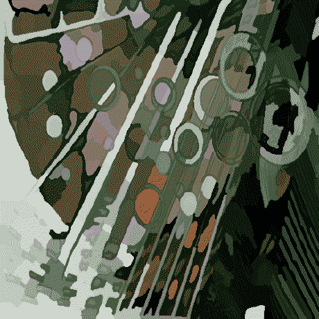

---
categories:
- "Grau: Graduado"
- "Área: Curry-Howard-Lambek isomorphism"
- "Área: Formal Semantics"
- "Área: Representation Theory"
- "Área: Virtualization"
- "Área: Operating Systems"
- "Área: Compiler design"
draft: true
title: deomorxsy
---

{fig-alt="a digital processed image from an illustration that resembles a mosaic-like, with waterpixels of something looking like a moss through the lens of a glass, reflecting sunbeams into a source of water at the ground below, next to it." width="400"}

whoami: Im into Sysadmin/DevSecOps/SRE, kernel inner workings, all things virtualization,
tracing/profiling and lately the Curry-Howard-Lambek isomorphism semantics
of ZFC (Zermelo-Fraenkel Set Theory and the axiom of Choice)
through the lens of 1) functional programming, 2) type theory, and 3) category theory.

## Instituição

Sistemas de Informação, Universidade de Pernambuco.

## Link para o site pessoal

<https://deomorxsy.github.io/>

